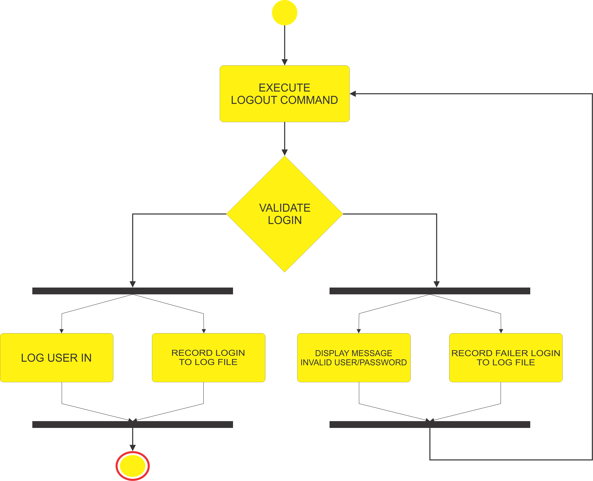
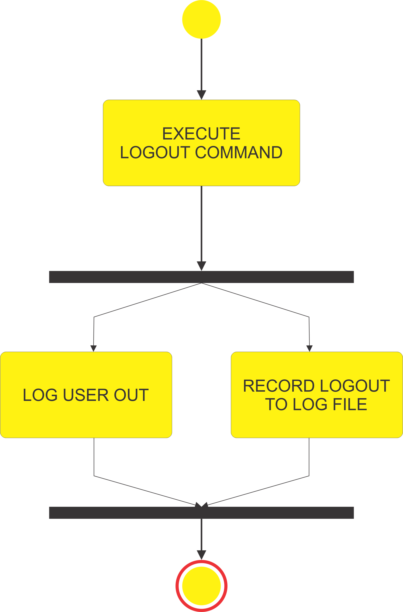
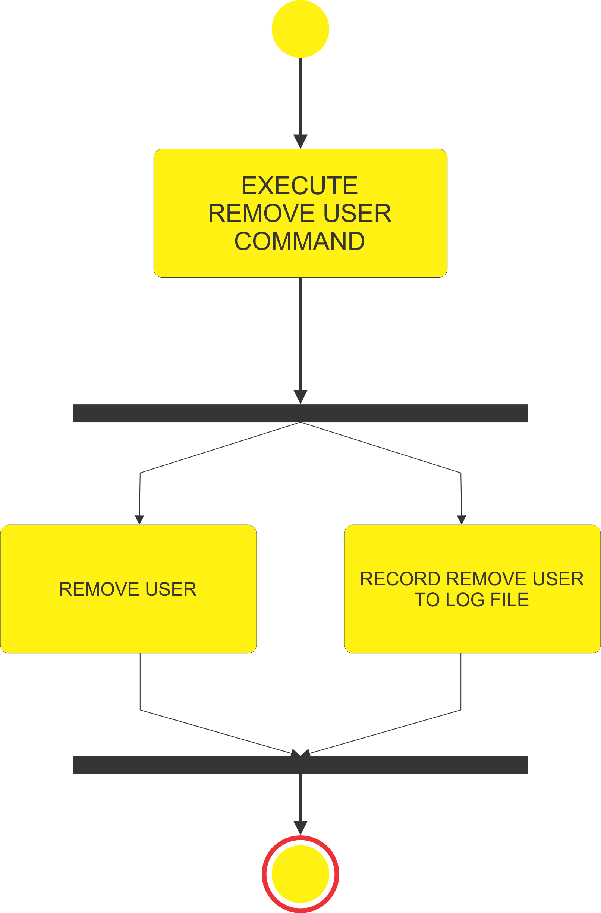
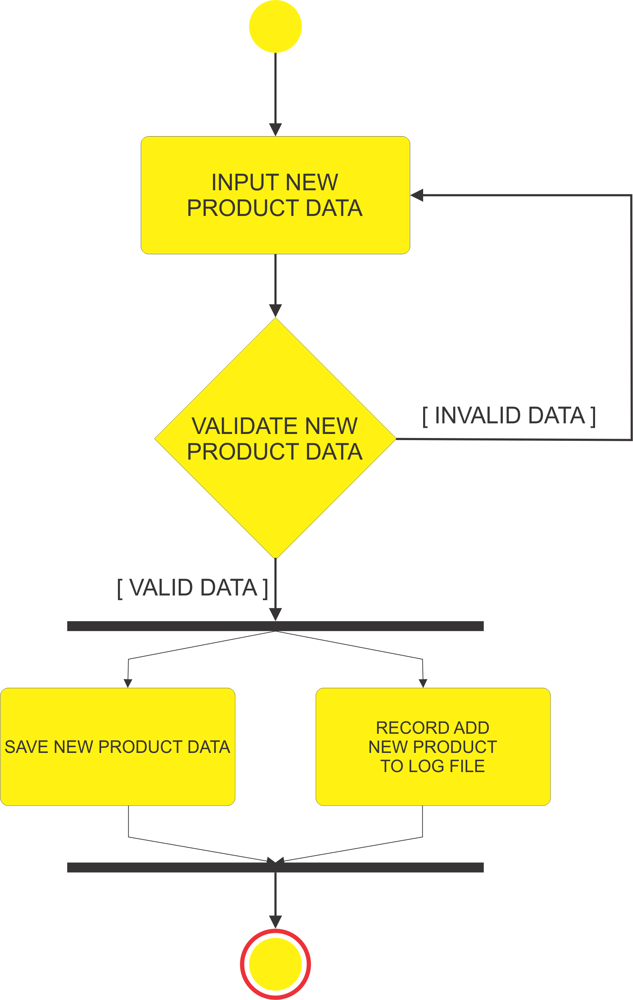
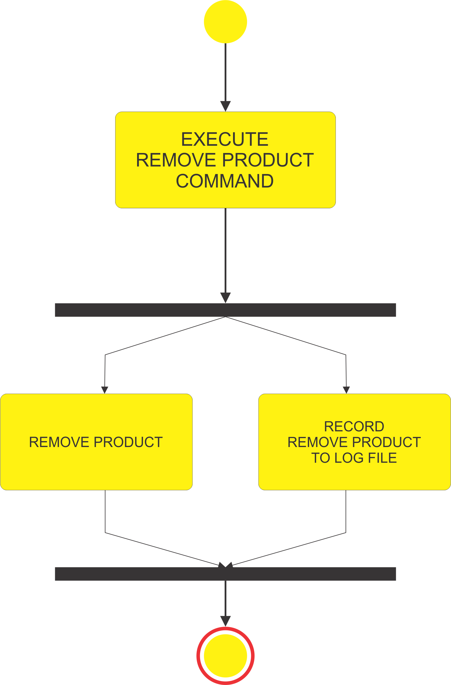
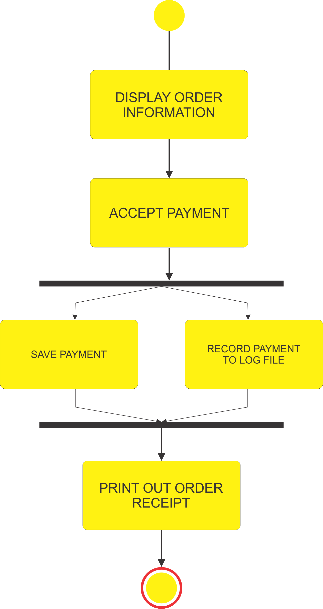

## Activity Diagram

*Activity diagram* untuk *use case* Fast Food Restaurant:

1. Login

   
      
2. Logout

   
   
3. Add new user

   

4. Remove user (disable user)

   
   
5. Update user account

   
   
6. Add new product

   
   
7. Remove product

   
   
8. Update product

   
   
9. Order

   
   
10. Payment

    
    